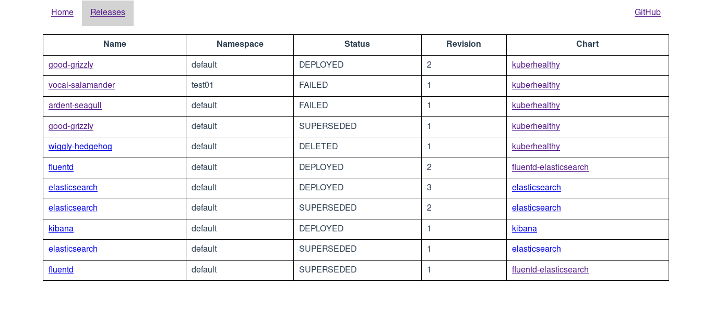

# Helm Cabin

Helm Cabin is a web UI that visualizes Helm releases 
in a Kubernetes cluster. 



## Motivation
 
I wasn't able to find a simple web UI that visualizes the data managed by 
Tiller without hiding information behind additional abstractions. 
I decided to scratch my own itch and started Helm Cabin as part of 
[Hacktoberfest 2019](https://hacktoberfest.digitalocean.com/). 

## Install

Install Helm Cabin with the provided chart. 

```bash
helm repo add helm-cabin https://nick-triller.github.io/helm-cabin/
helm repo update
helm upgrade --install helm-cabin helm-cabin/helm-cabin
```

Helm Cabin doesn't handle TLS itself. Please use a reverse proxy, 
e. g. [Traefik](https://traefik.io/), for TLS termination.

## Project architecture

The project layout is based on 
[golang-standards/project-layout](https://github.com/golang-standards/project-layout).

### Backend

The backend periodically retrieves all releases including deleted releases and superseded revisions  
from Tiller. 
The result is cached in memory. 
Obviously, polling is a suboptimal solution if the number of 
releases (or revisions) is large because a lot of data is transferred on each poll.

Helm Cabin tries to connect with Tiller via `tiller-deploy.kube-system.svc.cluster.local` by default. 
The tiller host can be overriden with the `tillerAddress` CLI flag.
Use port forwarding for local development.

### Frontend

The frontend source is located in the web directory and uses VueJS. 
Take a look at the [frontend README](./web/README.md) for usage instructions. 
